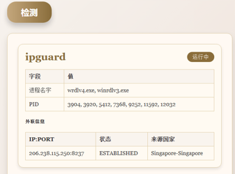

# SilverFoxGuardian


## 功能作用
> 专为银狐排障辅助工具，快速定位银狐运行起来后释放第三方商业远控工具，已支持一下
- [x] ipguardV4、ipguardV3
- [x] Nsec(ping32)
- [x] 固信
- [ ] 阳途
- [ ] gotohttp
- [ ] 连连控



## 编译过程
### Windows
1. **Windows 环境要求**
    - 请确保在 Windows 下有 **高版本的 GCC 环境**，否则可能会导致编译错误。

2. **编译命令**
    - 使用以下命令进行编译：
      ```bash
      go mod tidy
      go build -ldflags="-H windowsgui" -o SilverFoxGuardian.exe
      ```

### Mac
1. **无环境要求**
2. **编译命令**
    - 使用一下命令进行编译：
   ```bash
   go mod tidy
   go build -o SilverFoxGuardian.exe
   ```

## 免责声明
本工具仅作为安全研究交流，请勿用于非法用途。如您在使用本工具的过程中存在任何非法行为，您需自行承担相应后果，本人将不承担任何法律及连带责任。

